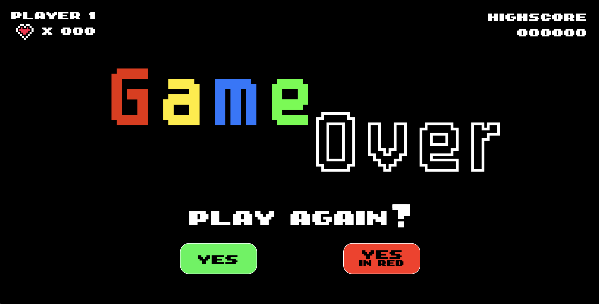
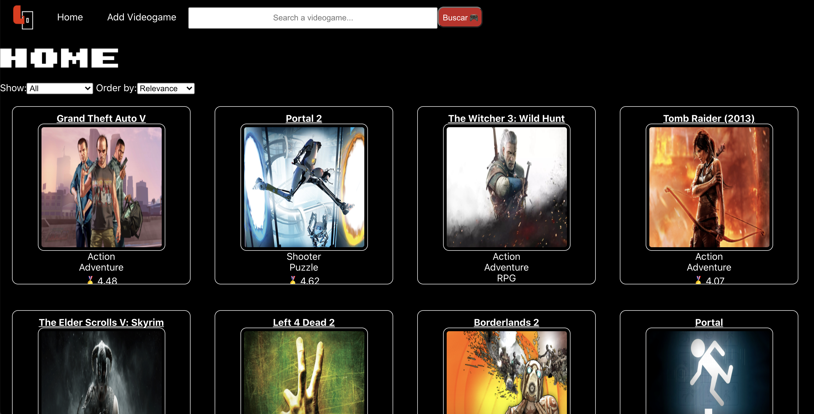
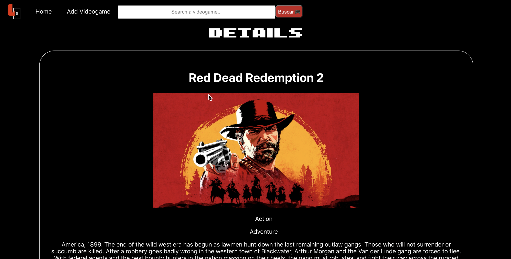

# Game Over- Videogames Project 👾

Single Page Application con temática de videojuegos, cuyo objetivo es la búsqueda, filtrado y orden de la data, así como la interacción del usuario con la base de datos por medio de la creación de nueva data.

<h5>
<h4>Client:</h4> React, Redux  
  <h4>Server:</h4> Node, Express, PostgreSQL, Sequelize</h5>

<h3> Imágenes 📷 <h3>
 

